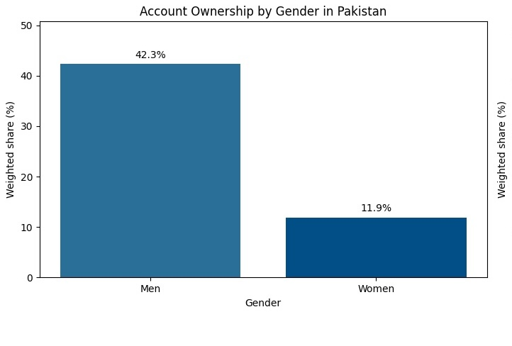

# Financial Inclusion in Pakistan: Global Findex 2025 Analysis

## Overview

This project analyzes financial inclusion in Pakistan using World Bank Global Findex 2025 microdata. It examines account ownership, gender gaps, income disparities, and digital finance adoption to understand who has access to formal and digital financial services.

The analysis demonstrates end-to-end data workflow: framing a research question, cleaning survey data, applying statistical weighting, and communicating findings with policy implications.

---

## Key Findings

### Overall Financial Access
- **Account ownership**: 27.3% of adults in Pakistan
- **Digital account ownership**: 19.8%
- **Digital payments**: 24.6%

### Gender Gap (Most Critical Finding)
Women are significantly underrepresented in financial access:

| Indicator | Men | Women | Gap |
|-----------|-----|-------|-----|
| Account ownership | 42.3% | 11.9% | 30.4 pp |
| Digital account | 34.1% | 5.3% | 28.8 pp |

### Income Gradient
Account ownership rises sharply with income:

| Income Quintile | Account Ownership |
|-----------------|-------------------|
| Quintile 1 (poorest) | 14.1% |
| Quintile 2 | 13.1% |
| Quintile 3 | 28.2% |
| Quintile 4 | 37.1% |
| Quintile 5 (richest) | 43.9% |

---

## Visualizations

### Chart 1: Account Ownership by Gender
Gender differences are stark and immediate. Men's account ownership is over 3.5x higher than women's.



### Chart 2: Account Ownership by Income Quintile
Financial access is concentrated in higher-income groups, with the richest quintile showing nearly 3x the ownership rate of the poorest.

.jpeg)

### Chart 3: Digital Account Ownership by Gender
The digital divide is even sharper than the basic account gap—women face compound barriers to digital finance.

.jpeg)

---

## Data and Methodology

### Data Source
**Global Findex 2025 Microdata** from the World Bank
- **Survey**: Global Financial Inclusion (Findex) Survey 2025 wave
- **Sample**: 1,000 respondents from Pakistan
- **Coverage**: Adults aged 15+
- **Weights**: Survey weights applied to reflect population-level estimates

**Access the data:**
1. Visit the [World Bank Global Findex webpage](https://microdata.worldbank.org/catalog/7860)
2. Create a free account, read the T&Cs, and provide a reason for use.
3. Download the 2025 microdata file (CSV format)
4. Place `findex_microdata_2025_labelled_update112425.csv` in your working directory

### Key Variables
- `account`: Binary indicator for any account ownership (1 = has account)
- `dig_account`: Binary indicator for digital account ownership
- `anydigpayment`: Binary indicator for any digital payment activity
- `female`: Gender indicator (1 = female, 2 = male)
- `inc_q`: Income quintile (1–5, with 5 being highest income)
- `wgt`: Survey weight for population estimates
- `economy`: Country code/name (filtered to "Pakistan")

### Methodology

**1. Data Loading & Filtering**
- Load full Global Findex CSV using Pandas
- Filter to Pakistan using `economy == "Pakistan"`
- Sample size: 1,000 respondents

**2. Data Tidying**
- Rename columns for clarity (e.g., `weighted_share_pct`)
- Handle missing values using `.dropna()`
- Round percentages to 1 decimal place

**3. Weighted Analysis**
- Apply survey weights (`wgt`) to calculate population-representative shares
- Use `numpy.average()` with weights parameter
- Formula: `(sum(indicator * weight) / sum(weight)) * 100`

**4. Aggregation**
- Group by gender (`female`) and income (`inc_q`)
- Calculate weighted shares for each subgroup
- Compute weighted sample sizes

**5. Visualization**
- Created 3 bar charts using Matplotlib
- Added value labels directly on bars
- Used consistent color palette for clarity

---

## Technical Stack

| Component | Tool |
|-----------|------|
| Data processing | Pandas |
| Numerical computation | NumPy |
| Visualization | Matplotlib |
| Notebook environment | Jupyter |
| Language | Python 3.8+ |

---

## How to Run This Analysis

### Prerequisites
- Python 3.8 or higher
- pip (Python package manager)

### Installation

1. **Clone the repository:**
```bash
git clone https://github.com/YOUR-USERNAME/financial-inclusion-pakistan-findex-2025.git
cd financial-inclusion-pakistan-findex-2025
```

2. **Install required packages:**
```bash
pip install -r requirements.txt
```

3. **Download the Global Findex data:**
   - Visit [World Bank Global Findex](https://microdata.worldbank.org/catalog/7860)
   - Create a free account and read the T&Cs
   - Download the 2025 microdata CSV
   - Save as `findex_microdata_2025_labelled_update112425.csv` in the project root

4. **Run the notebook:**
```bash
jupyter notebook notebook/Financial_Inclusion_Pakistan_2025.ipynb
```

### Expected Output
- 3 summary tables (overall, by gender, by income)
- 3 visualization charts
- Interpretation and policy implications

---

## Project Structure

```
financial-inclusion-pakistan-findex-2025/
├── README.md                                          # This file
├── requirements.txt                                   # Python dependencies
├── notebook/
│   └── Financial_Inclusion_Pakistan_2025.ipynb       # Main analysis notebook
├── reports/
│   └── Financial_Inclusion_Pakistan_Report.pdf       # Written findings (1–2 pages)
├── charts/
│   ├── account_by_gender.png
│   ├── account_by_income.png
│   └── digital_account_by_gender.png
└── .gitignore
```

---

## Key Insights & Real-World Implications

### For Policymakers
- **Targeted women's programs**: Current barriers (legal, cultural, financial literacy) prevent women from accessing formal finance
- **Lower-income focus**: Bottom 2 quintiles show <15% account ownership; affordability and proximity matter
- **Digital adoption need**: Digital accounts lag behind basic accounts, suggesting access without confidence or capability

### For Development Organizations
- **NGO partnerships**: Work with organizations that reach women and lower-income groups
- **Mobile banking**: Leverage mobile for geographic/accessibility barriers
- **Financial literacy**: Pairing account access with training could boost digital adoption

### For Financial Institutions
- **Market opportunity**: 70%+ of Pakistan's population lacks formal accounts
- **Women's segments**: Custom products for women (safety, convenience, microfinance)
- **Income tiers**: Scalable solutions for different income levels

---

## Limitations & Caveats

1. **Cross-sectional**: This snapshot shows associations, not causal relationships
2. **Survey bias**: Self-reported data; possible underreporting of women's financial activity
3. **Variable constraints**: Analysis limited to Global Findex variables; broader context (employment, education) not included
4. **Timing**: 2025 data; trends may shift with policy changes or economic shocks
5. **Geographic**: Pakistan-wide aggregate; sub-national variation not explored

---

## Next Steps & Improvements

If extending this analysis, consider:
- **Time series**: Compare 2021, 2023, 2025 waves to track trends
- **Macro merge**: Add GDP per capita, unemployment, or financial sector metrics
- **Sub-group analysis**: Break down by rural/urban, education level, or regions
- **Causal inference**: Investigate determinants via logistic regression or propensity matching

---

## Questions & Contact

For questions about this analysis:
- **Methods**: Review the notebook for code documentation and comments
- **Data**: Consult World Bank Global Findex documentation
- **Findings**: See the written report in `reports/`

---

## Data Attribution

**Data source**: World Bank Global Financial Inclusion (Findex) Database 2025  
**Citation**: [World Bank Group. (2025). Global Financial Inclusion Index. Retrieved from https://www.worldbank.org/en/publication/globalfindex](https://www.worldbank.org/en/publication/globalfindex)(https://microdata.worldbank.org/catalog/7860)

**Analysis date**: December 2025  
**Analyst**: Khadija Tahir (tkhadija@umich.edu)

---

